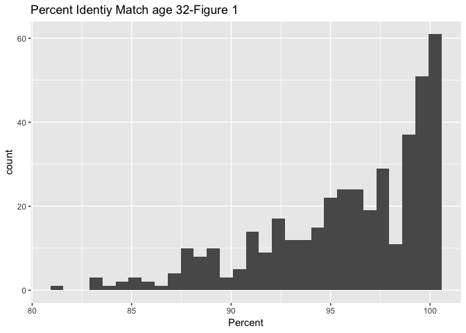
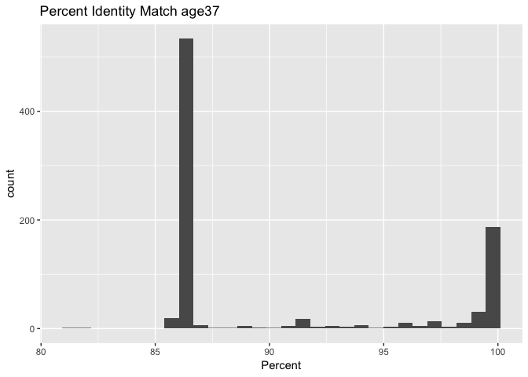

Analysis of BLAST Results
================
Leila Esmaeili
October 21, 2018

Introduction
============

Add 1-2 paragraphs here.

Methods
=======

Sample origin and sequencing
----------------------------

Add about a paragraph here.

Computational
-------------

And another paragraph or two here.

Results
=======

``` r
# Be sure to install these packages before running this script
# They can be installed either with the install.packages() function
# or with the 'Packages' pane in RStudio

# load packages
library("dplyr")  # This is for tables
library("tidyr") # creates tidy data
library("knitr") # generates reports
library("ggplot2") # creates plot
```

``` r
# Output format from BLAST is as detailed on:
# https://www.ncbi.nlm.nih.gov/books/NBK279675/
# In this case, we used: '10 sscinames std'
# 10 means csv format
# sscinames means unique Subject Scientific Name(s), separated by a ';'
# std means the standard set of result columns, which are:
# 'qseqid sseqid pident length mismatch
# gapopen qstart qend sstart send evalue bitscore',


# this function takes as input a quoted path to a BLAST result file
# and produces as output a dataframe with proper column headers
# and the 'qseqid' column split into sample and seq number
read_blast_output <- function(filename) {
  data_in <- read.csv(filename,
                      header = FALSE, # files don't have column names in them
                      col.names = c("sscinames", # unique Subject Sci Name(s)
                                    "qseqid",    # Query Seq-id
                                    "sseqid",    # Subject Seq-id
                                    "pident",    # Percntge of identical matches
                                    "length",    # Alignment length
                                    "mismatch",  # Number of mismatches
                                    "gapopen",   # Number of gap openings
                                    "qstart",    # Start of alignment in query
                                    "qend",      # End of alignment in query
                                    "sstart",    # Start of alignment in subj
                                    "send",      # End of alignment in subject
                                    "evalue",    # Expect value
                                    "bitscore"))  # Bit score

  # Next we want to split the query sequence ID into
  # Sample and Number components so we can group by sample
  # They originally look like "ERR1942280.1"
  # and we want to split that into two columns: "ERR1942280" and "1"
  # we can use the separate() function from the tidyr library to do this
  # Note that we have to double escape the period for this to work
  # the syntax is
  # separate(column_to_separate,
  # c("New_column_name_1", "New_column_name_2"),
  # "seperator")
  data_in <- data_in %>%
    separate(qseqid, c("sample_name", "sample_number"), "\\.")
}
```

``` r
# this makes a vector of all the BLAST output file names, including
# the name(s) of the directories they are in
files_to_read_in <- list.files(path = "output/blast",
                               full.names = TRUE)

# We need to create an empty matrix with the right number of columns
# so that we can rbind() each dataset on to it
joined_blast_data <- matrix(nrow = 0,
                            ncol = 14)

# now we loop over each of the files in the list and append them
# to the bottom of the 'joined_blast_data' object
# we do this with the rbind() function and the function we
# made earlier to read in the files, read_blast_output()
for (filename in files_to_read_in) {
  joined_blast_data <- rbind(joined_blast_data,
                             read_blast_output(filename))
}
```

``` r
# Next we want to read in the metadata file so we can add that in too
# This is not a csv file, so we have to use a slightly different syntax
# here the `sep = "\t"` tells the function that the data are tab-delimited
# and the `stringsAsFactors = FALSE` tells it not to assume that things are
# categorical variables
metadata_in <- read.table(paste0("data/metadata/",
                                 "fierer_forensic_hand_mouse_SraRunTable.txt"),
                          sep = "\t",
                          header = TRUE,
                          stringsAsFactors = FALSE)

# Finally we use the left_join() function from dplyr to merge or 'join' the
# combined data and metadata into one big table, so it's easier to work with
# in R the `by = c("Run_s" = "sample_name")` syntax tells R which columns
# to match up when joining the datasets together
joined_blast_data_metadata <- metadata_in %>%
  left_join(joined_blast_data,
            by = c("Run_s" = "sample_name"))
```

``` r
# Here we're using the dplyr piping syntax to select a subset of rows matching a
# criteria we specify (using the filter) function, and then pull out a column
# from the data to make a histogram.
joined_blast_data_metadata %>%
  filter(age_s == 32) %>%  #This is what we are filtering based on specfic column
  ggplot(aes(x = pident)) +  # this is for x axis
    geom_histogram() +
    ggtitle("Percent Identiy Match age32") + # This is our title
    xlab("Percent") # this is our x axis label
```

    ## `stat_bin()` using `bins = 30`. Pick better value with `binwidth`.



Don't forget to report what your figures show in words, here in the Results section.

``` r
# Here we're using the dplyr piping syntax to select a subset of rows matching a
# criteria we specify (using the filter) function, and then pull out a column
# from the data to make a histogram.
joined_blast_data_metadata %>%
  filter(age_s == 37) %>%
  ggplot(aes(x = pident)) +
    geom_histogram() +
    ggtitle("Percent Identity Match age37") +
    xlab("Percent")
```

    ## `stat_bin()` using `bins = 30`. Pick better value with `binwidth`.



``` r
# Finally, we'd like to be able to make a summary table of the counts of
# sequences for each subject for both sample types. To do that we can use the
# table() function. We add the kable() function as well (from the tidyr package)
# in order to format the table nicely when the document is knitted
kable(table(joined_blast_data_metadata$host_subject_id_s,
            joined_blast_data_metadata$sample_type_s))
```

|     |  computer mouse|  right palm|
|-----|---------------:|-----------:|
| F2  |             396|         410|
| F5  |             365|         777|
| F6  |             662|         422|
| F7  |             655|         546|
| F8  |             878|         374|
| M1  |             456|         878|
| M2  |             670|         775|
| M7  |             970|         689|
| M8  |             717|         280|
| M9  |             571|         968|

Discussion
==========

Add 2-3 paragraphs here interpreting your results and considering future directions one might take in analyzing these data.
